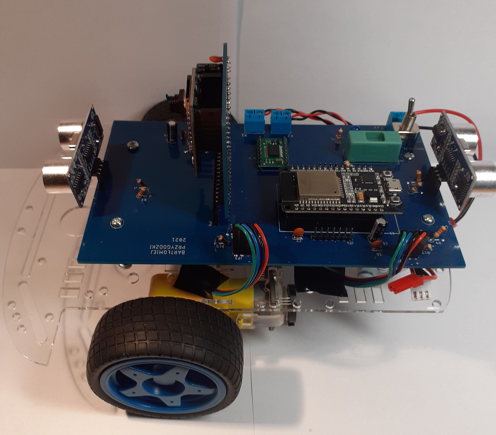

# Design and construction of a mobile robot 
## English
This engineering thesis is written in Polish. However, if someone wants to see the code for ESP 32 CAM microcontrollers for transmitting the image from the camera and ESP 32 for controlling the control via wifi, you are welcome. 

The work presents the construction process and implementation of a mobile robot software
equipped with a camera. Its assumption is to construct a remotely controlled unit enabling
smooth image transmission. The scope of work is also related to the commissioning and testing
of the constructed structure.

The completed vehicle was designed to work well at home. It was with this in mind that
the engines and the platform were selected. During the design stage, it was decided to use
two microcontrollers, due to the limitations of one of them and the desire to liquefy the
camera image. The method of selecting a driver for motors, sonars, power source and voltage
stabilizer has also been described. When designing the electronic part, care was taken to ensure
the appropriate temperature of the system and safety in the event of short circuits. Schematic
diagrams and block diagrams of electrical connections in the system are also presented. There
is also a description of two hand-designed PCBs.

As part of the work, the robot successfully communicated with the user via wi-fi. A website
was also written to serve as a driving control panel. It contains the image from the robot’s
camera as well as the results of distance and voltage measurements. UART’s communications
were also used to pass commands between the microcontrollers.

In order to drive the robot in a straight line, three methods of regulation were compared.
They were made on the basis of PI regulators, which synchronized the work of the engines or
did not do it. There are also written anti-collision functions while driving based on distance
measurements made with the use of sonars.
## Polish

Praca przedstawia proces budowy oraz implementację oprogramowania robota mobilnego
wyposażonego w kamerę. Jej założeniem jest skonstruowanie zdalnie sterowanej jednostki
umożliwiającej płynne przekazywanie obrazu. Zakres pracy wiąże się również z uruchomieniem
i przetestowaniem wykonanej konstrukcji.

Analizując tematykę zagadnienia, dokonano zestawienia trzech robotów z kamerą. Do
tego celu wybrano konstrukcje o zróżnicowanej budowie oraz przeznaczeniu. Z ich opisów
zaczerpnięto zastosowania później wykorzystane we własnym robocie.

Wykonany pojazd został zaprojektowany tak, aby sprawdzał się w warunkach domowych.
Pod tym kątem dokonano wyboru silników oraz platformy. W czasie projektowania zdecydowano
się na użycie dwóch mikrokontrolerów, z powodów ograniczeń jednego z nich oraz
z chęci upłynnienia obrazu kamery. Dokonano również opisu sposobu doboru sterownika
silników, sonarów, źródła zasilania oraz stabilizatora napięcia. Projektując część elektroniczną,
zadbano o odpowiednią temperaturę układu oraz o bezpieczeństwo w przypadku wystąpienia
zwarć. Przedstawiono też schematy ideowe oraz blokowe połączeń elektrycznych w układzie.
Umieszczono również opis dwóch własnoręcznie zaprojektowanych płytek PCB.

W ramach pracy dokonano udanej komunikacji robota z użytkownikiem za pomocą wi-fi.
Napisano również stronę internetową służącą jako panel kontroli jazdy. Witryna wyświetla obraz
z kamery robota oraz wyniki pomiarów odległości i napięcia. Zastosowano również komunikacje
UART w celu przekazywania poleceń między mikrokontrolerami.

Aby zrealizować jazdę robota po linii prostej, dokonano porównania trzech sposobów
regulacji. Były one zrealizowane na postawie regulatorów PI, które synchronizowały prace
silników lub tego nie robiły. Napisano również funkcje zabezpieczające przed kolizją w czasie
jazdy na podstawie pomiarów odległości wykonywanych za pomocą sonarów.

W czasie testów dokonano oceny otrzymywanego obrazu. Okazał on się płynny i wyraźny
na tyle, by zidentyfikować co, znajduje się w otoczeniu robota. Za pomocą wyników testu
jazdy po linii prostej wykonano zestawienie osiągnięć różnych sposobów sterowania. Udało
się dzięki temu wytypować najlepszy z nich. Dokonano również sprawdzenia bezkolizyjności
robota. Zastosowane sonary okazały się wystarczające, jednak znaleziono też wady użytego
zastosowania. Można uznać, że całościowy projekt sprawdził się w swoim przeznaczeniu.

## Pictures

Feel free to use
